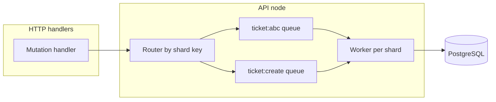

# Per-node mutation queue (tickets, todos, links, timers)

## Context

- The Rust API already has a **login-style async job** pattern in `[apps/api/src/auth/login_queue.rs](apps/api/src/auth/login_queue.rs)`: handler returns **202**, stores state in `LoginJobs` (`Arc<Mutex<HashMap<...>>>`), spawns a retry loop, clients poll `GET /auth/login/status/{job_id}`. `[AppState](apps/api/src/routes/mod.rs)` holds `login_jobs` and `register_jobs`.
- Domain routes today run **directly against `PgPool`** with no cross-request ordering:
  - Tickets: `[apps/api/src/routes/tickets.rs](apps/api/src/routes/tickets.rs)`
  - Todos: `[apps/api/src/routes/todos.rs](apps/api/src/routes/todos.rs)`
  - Links: `[apps/api/src/routes/links.rs](apps/api/src/routes/links.rs)`
  - Time tracking: `[apps/api/src/routes/time_tracking.rs](apps/api/src/routes/time_tracking.rs)`
  - Search (read-only): `[apps/api/src/routes/search.rs](apps/api/src/routes/search.rs)`

You confirmed: **queue mutations only**; **reads (including search) stay synchronous**, with optional **coalescing** for identical in-flight searches.

## Design goals

| Goal                  | Approach                                                                                                                                                                                                                                                                                                           |
| --------------------- | ------------------------------------------------------------------------------------------------------------------------------------------------------------------------------------------------------------------------------------------------------------------------------------------------------------------ |
| No duplicates         | **Idempotency-Key** (optional header) + in-node dedup map (TTL); retries return same outcome.                                                                                                                                                                                                                      |
| No races / corruption | **Per-shard serialization** on the node + **row-level DB locks** on execute (`SELECT … FOR UPDATE` in a short transaction) so cross-node writers wait on the same row; plus **atomic numbering** (sequence/counter) for creates.                                                                                   |
| Reads vs writes       | **Writes** hold row locks only for the duration of the transaction. **Reads** use normal `SELECT` (no `FOR UPDATE`/`FOR SHARE` on list/get/search paths) so PostgreSQL **MVCC** applies: readers are not blocked by writers’ row locks and performance characteristics of read traffic stay essentially unchanged. |
| Per-node queue        | One logical **dispatcher per process**; shards keyed so unrelated resources run in parallel.                                                                                                                                                                                                                       |
| Future replication    | Extract a `**CommandExecutor` / `CommandSink` trait**: today enqueue to `tokio::mpsc` + workers; later a replication worker pushes the same `Command` enum into the executor (or reads from an outbox table).                                                                                                      |
| Performance           | **Do not** force 202+polling on every mutation unless you opt in later: recommended default is **enqueue + await oneshot** so HTTP status/latency stay similar to today while work is **serialized per shard**. Use **many shards** (per `ticket_id`, per `user_id` for creates, etc.) so throughput stays high.   |

### Recommended HTTP semantics (performance-first)

- **Default**: Handler validates auth/permissions cheaply, submits a **command** to the node queue, **waits** for the worker result (oneshot), returns **same** 200/201/4xx as now. Clients need no change.
- **Optional later** (login-parity): `POST` with `Prefer: respond-async` or a config flag → **202** + `job_id` + `GET …/command-jobs/{id}` for long operations (e.g. `extract_metadata`, bulk time ops).

This satisfies “queued on the node” and “does not impact performance” better than mandatory polling for every PATCH.

## Mutation inventory (must go through the queue)

### Tickets (`[tickets.rs](apps/api/src/routes/tickets.rs)`)

- `POST /tickets` — create (assigns `ticket_number` via `next_ticket_number`)
- `PATCH /tickets/{id}` — update (assign, status, archive, tags, …)
- `DELETE /tickets/{id}`
- `POST /tickets/{id}/comments` — comment + activity insert (multi-step; keep one transaction in the worker)

**Stays direct (reads):** `GET /tickets`, `GET /tickets/{id}`, `GET …/comments`, `GET …/activities`.

### Todos (`[todos.rs](apps/api/src/routes/todos.rs)`)

- `POST /todos` — create (sequential `todo_number`)
- `PATCH /todos/{id}` — update (assign, status, archive, order, …)
- `DELETE /todos/{id}` — deletes children then self

**Stays direct:** `GET /todos`, `GET /todos/{id}`.

### Links (`[links.rs](apps/api/src/routes/links.rs)`)

- `POST /links` — create
- `PUT /links/{id}` — update
- `DELETE /links/{id}`
- `POST /links/metadata` and alias `…/extract-metadata` — **high latency** (external fetch); strong candidate for **async job** or at minimum **dedicated shard** so link list traffic is not blocked

**Stays direct:** `GET /links`, `GET /links/{id}`, `GET /links/tag-suggestions`.

### Time tracking (`[time_tracking.rs](apps/api/src/routes/time_tracking.rs)`)

- `POST /time-tracking` — create
- `POST /time-tracking/add` — manual entry
- `PATCH /time-tracking/{id}` — update
- `DELETE /time-tracking/{id}`
- `POST /time-tracking/{id}/stop` | `/pause` | `/resume` | `/complete`
- `POST /time-tracking/{id}/breaks` — add break
- `PATCH /time-tracking/{id}/breaks/{break_id}` | `DELETE …`
- `POST /time-tracking/bulk-update` | `bulk-archive` | `bulk-delete`

**Stays direct:** `GET /time-tracking`, `…/active`, `…/tags`, `GET /time-tracking/{id}`.

### Search (`[search.rs](apps/api/src/routes/search.rs)`) — read path only

- No mutation queue.
- **Optional coalescing**: in-node `HashMap<normalized_query_key, SharedFuture>` (or `tokio::sync::OnceCell` pattern) so **identical** `(user_id, q, limit, type_filter)` while a query is in flight only hits DB once; **short-lived** entries to avoid stale results. This is a micro-optimization under load, not a correctness requirement.

## Sharding keys (ordering without global bottleneck)

Use a stable key so all commands that must be **totally ordered** for a resource share one FIFO:

- **Ticket `T`**: shard `ticket:{T}` for updates, comments, delete. **Creates** (no id yet): shard `ticket:create` (global per node) *or* `ticket:create:{user_id}` if per-user ordering is enough — prefer **global `ticket:create`** on the node so `next_ticket_number` is never interleaved incorrectly across users on that node.
- **Todo `id`**: `todo:{id}` for updates/deletes; `**todo:create**` global (or per-user) for numbering — same reasoning as tickets.
- **Link `id`**: `link:{id}`; `**link:create:{user_id}**` (usually sufficient).
- **Time entry `id`**: `time:{id}` for single-entry ops; **bulk**: `time:bulk:{user_id}` so bulk ops for one user don’t interleave.
- **Metadata extract**: `link:metadata:{user_id}` or per-request single-use shard.

Workers: one **task per shard** (lazy spawn on first message) *or* bounded pool of consumers pulling from a **hash ring** of queues — implementation detail; important invariant is **one command at a time per shard key**.

## Row-level DB locking when a queued write runs

Requirement: when the worker is about to apply a mutation, **lock the persisted row(s)** so no other transaction can modify those rows until the change commits; other writers block; **reads must remain possible** and read performance must not be sacrificed.

**PostgreSQL behavior (fits this directly):**

- At the start of the write, open a transaction and run `SELECT id FROM <table> WHERE id = $1 FOR UPDATE` (or `FOR NO KEY UPDATE` when you only update non-key columns—optional micro-optimization). That acquires a **row-level exclusive lock** for the duration of the transaction.
- **Concurrent writers** that try `UPDATE`/`DELETE`/`SELECT … FOR UPDATE` on the same row **wait** until your transaction commits or rolls back—this is the “others wait until unlocked” behavior.
- **Concurrent readers** using ordinary `SELECT` (what all current list/get/search handlers use) **do not take that lock** and are **not blocked** waiting on `FOR UPDATE`; they read committed snapshots per isolation level (default `READ COMMITTED`). So **read latency/throughput is not degraded** by this pattern; the only extra cost is on **write** paths (one locking read + bounded lock hold time).

**Implementation rules:**

1. **One transaction per command** where practical: `BEGIN` → lock row(s) → `UPDATE`/`INSERT`/`DELETE` → `COMMIT`. Keep transactions **short** (no external HTTP inside the locked section—e.g. move `extract_metadata` fetch outside, or lock only for the final `UPDATE links` after fetch).
2. **Existing entity** (`PATCH`, `DELETE`, comment on ticket, break on time entry): lock the **primary resource row** first (`tickets`, `todos`, `links`, `time_entries`), then apply dependent writes (e.g. `ticket_comments` + `ticket_activities`) **in the same transaction** so the ticket row stays locked for the whole operation.
3. **Multi-row commands** (e.g. `delete_todo` with children, bulk time ops): lock rows in a **deterministic order** (e.g. by `id` ascending) to reduce **deadlock** risk when two transactions touch overlapping sets.
4. **Creates** (no row id yet): there is no row to `FOR UPDATE` until insert. Use the **atomic counter/sequence** transaction (lock the counter row or use `nextval`) as the serialization point; optional `pg_advisory_xact_lock(hashtext('ticket:create'))` only if you need a single global critical section beyond the counter—prefer **narrow** locks (counter row) over global advisory locks for performance.
5. **Do not** add `FOR UPDATE` to read/list/search queries; that would block reads behind writers and violate the goal.

### Lock start timestamp and maximum hold time (“TTL” for stuck work)

**Reality check:** PostgreSQL **row locks do not accumulate** as separate objects in the database. A `FOR UPDATE` lock is held only for the life of the **open transaction**; `COMMIT` or `ROLLBACK` always releases it. “Nothing works anymore” usually means a **long-running or hung transaction** (or leaked connection) keeps holding locks, so other **writers** wait indefinitely.

Still, match the product requirement explicitly:

1. **Always record a timestamp** when the mutation transaction is considered “active for locking”—e.g. immediately after `BEGIN` or immediately before the first `SELECT … FOR UPDATE`. Store it on the **worker context** (and optionally log `shard_key`, `command_type`, `user_id`, `resource_id` for ops).
2. **Maximum lock / transaction duration** (configurable, e.g. `COMMAND_DB_TX_MAX_MS` in the 5–30s range depending on bulk ops): wrap the DB section in a **timeout** (`tokio::time::timeout` or equivalent). On expiry, **drop the `Transaction`** / cancel the query so PostgreSQL **rolls back** and **releases all row locks** for that command. Return a clear error (e.g. 503/504) so the client can retry.
3. **Waiters must not block forever:** set **`lock_timeout`** on the connection/pool used by workers (e.g. a few seconds) so a second writer **fails** if it cannot acquire `FOR UPDATE` in time, instead of waiting until the holder finishes—paired with (2) so the holder is bounded.
4. **Session-level safety nets** on the same pool (or a dedicated writer role): **`statement_timeout`** (cap per-statement CPU/IO), **`idle_in_transaction_session_timeout`** (rollback if the app opens a transaction then stalls without committing)—both release locks automatically.
5. **Optional observability:** per-shard in-memory `current_command_lock_started_at` (and command id) updated when a job starts and cleared on completion, for metrics/debug endpoints—this is **not** a second lock layer; PostgreSQL remains source of truth.

**Reads:** unchanged—plain `SELECT` paths are unaffected; timeouts apply only to **mutation** transactions.

**Cross-node:** the in-node queue orders work per shard on one process; **another API replica** can still issue a concurrent `UPDATE` on the same row. **`FOR UPDATE` in the worker transaction** is what forces those writers to serialize at the database—so the queue + row lock combine **local ordering** with **global write exclusion** on each row. The **timestamp + max duration** bounds ensure a crashed or stuck replica’s transaction is either ended by the DB (`idle_in_transaction_session_timeout`) or by bounded app-side cancellation where implemented.

## Correctness: DB-level fixes (required alongside queuing)

Queuing on one node **does not** fix races across **multiple API replicas** or races that already exist **within** a single process if numbering uses read-then-write:

- `[next_ticket_number](apps/api/src/routes/tickets.rs)` and todo numbering in `[create_todo](apps/api/src/routes/todos.rs)` use “max existing + 1” patterns — unsafe with multiple workers or multiple nodes.

**Plan:**

1. Add a **database sequence** or a **single-row counter table** with `UPDATE … RETURNING` inside a transaction (or `INSERT … ON CONFLICT DO UPDATE RETURNING`), and generate `TSK-000001` / `#TDO-000001` from that counter.
2. Optionally add **unique constraints** on `ticket_number` / `todo_number` so duplicates fail fast.

Execute numbering **inside the same transaction** as `INSERT` for the entity.

## Idempotency (no duplicate side effects)

- Accept optional header **`Idempotency-Key`** (string, max length capped).
- In-node store: `key -> (expires_at, completed_result_summary)` e.g. 24h TTL, bounded LRU to cap memory.
- If the same key arrives for the **same route + user + body hash** (or stored body hash), return **cached response** without re-executing.
- For **creates**, cache `{ id, ticket_number }` / `{ id }` etc.

This addresses duplicate submits from flaky networks without requiring clients to switch to 202 polling.

## Replication-layer migration path

1. Define **DomainCommand** enums (or one enum with modules) and a **CommandProcessor** trait: `async fn handle(&self, cmd, pool) -> Result<…>`.
2. Today: HTTP → **in-memory broker** → processor.
3. Tomorrow: replication → **append log / outbox** → same `CommandProcessor` (or binary-compatible messages). The **shard key** becomes the **partition key** for ordering guarantees in the distributed log.

Avoid baking `LoginJobs`-style status maps into the core path unless you add async mode; keep status storage pluggable.

## Implementation phases

1. **Infrastructure**: `command_queue` module (shard router, oneshot replies, backpressure policy, metrics hooks: queue depth per shard, drop/timeout policy; **per-command lock start time + max DB transaction duration**).
2. **DB migration**: atomic ticket/todo numbering.
3. **Refactor handlers**: extract “pure” DB functions from route handlers; route becomes thin: auth + enqueue + await. Each processor path uses **`sqlx::Transaction`** with **`SELECT … FOR UPDATE`** before mutating; configure **`lock_timeout`**, **`statement_timeout`**, and **`idle_in_transaction_session_timeout`** on the worker pool as appropriate.
4. **Wire modules** in order of risk: **tickets** (lock ticket row → comment + activity in same tx) → **todos** (lock parent for subtree rules if needed) → **links** (metadata: minimize lock scope) → **time_tracking** (lock entry row; bulk: lock all targets in sorted order).
5. **Idempotency** middleware or per-handler helper.
6. **Tests**: concurrency tests for numbering; two parallel creates; idempotent replay; same-ticket concurrent PATCHes applied in order.
7. **Optional**: search coalescing behind a feature flag.

## Files likely touched

- New: `apps/api/src/command_queue/` (or `apps/api/src/work/`) — broker, shard map, types.
- `[apps/api/src/routes/mod.rs](apps/api/src/routes/mod.rs)` — add `CommandBroker` (or similar) to `AppState`.
- `[apps/api/src/lib.rs](apps/api/src/lib.rs)` / wiring if needed.
- Handlers in `[tickets.rs](apps/api/src/routes/tickets.rs)`, `[todos.rs](apps/api/src/routes/todos.rs)`, `[links.rs](apps/api/src/routes/links.rs)`, `[time_tracking.rs](apps/api/src/routes/time_tracking.rs)`.
- New SQL migration under the API’s migration folder (path as used by this repo’s sqlx migrate).
- `[apps/api/tests/http_integration.rs](apps/api/tests/http_integration.rs)` — extend for ordering/idempotency if feasible.

## Risk notes

- **Write contention**: two concurrent writers on the **same row** serialize at the DB; **`lock_timeout`** on waiters avoids indefinite waits if a holder misbehaves (and **max tx duration** bounds the holder).
- **Multi-node**: per-node queue only gives **per-node** ordering; **global** ordering for `ticket_number` requires the **DB sequence/counter** (above), not the queue alone.
- **Backpressure**: bounded channels; on full queue return **503** or **429** with `Retry-After` (documented), so overload does not OOM the node.
- **`extract_metadata`**: consider **timeout** and isolation so slow upstreams do not block other link commands for that user shard.

