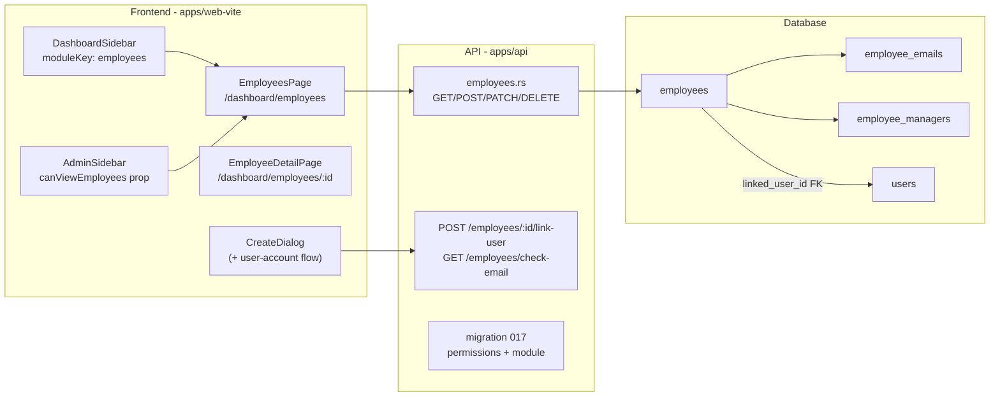
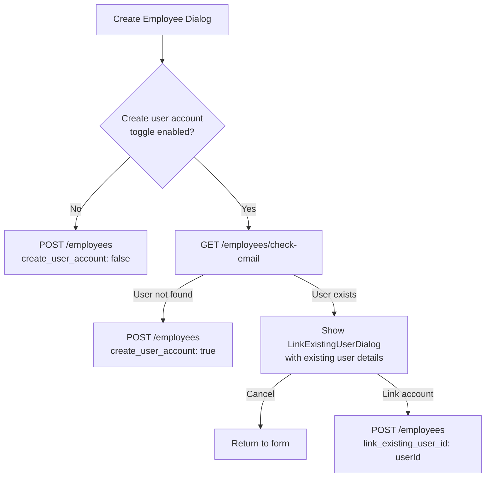

# Employee Management Feature Plan

## Architecture Overview



## 1. Database Migration `016_employees.sql`

New file: `apps/api/migrations/016_employees.sql`

- Enum `employee_status_enum`: `ACTIVE`, `INACTIVE`, `ON_LEAVE`, `PROBATION`, `TERMINATED`
- `employees` table: `id TEXT PK`, `first_name`, `last_name`, `email TEXT NOT NULL`, `title`, `employee_status employee_status_enum`, `company_role`, `department TEXT` (placeholder), `monthly_salary NUMERIC(12,2)`, `monthly_expenses NUMERIC(12,2)` (placeholder), `hours_worked NUMERIC(10,2)` (placeholder), `vacation_available INT`, `vacation_used INT`, `vacation_planned INT`, `sick_days_total INT`, `sick_days_available INT`, `linked_user_id TEXT REFERENCES users(id) ON DELETE SET NULL`, `created_at`, `updated_at`
- `employee_emails` table: `id TEXT PK`, `employee_id FK`, `email TEXT NOT NULL`, `label TEXT` (e.g. "work", "personal"), `created_at`
- `employee_managers` join table: `employee_id FK`, `manager_employee_id FK`, `UNIQUE(employee_id, manager_employee_id)`

## 2. Permission Migration `017_employee_permissions.sql`

New file: `apps/api/migrations/017_employee_permissions.sql`

- Insert `employees` module (`key = 'employees'`, `enabled = true`)
- Insert permissions: `employees.view`, `employees.create`, `employees.update`, `employees.delete`, `modules.employees.view`
- Grant all five to the default admin group (mirrors pattern in `003_default_group_and_assign_permissions.sql`)

## 3. Rust API: `apps/api/src/routes/employees.rs`

New module. Pattern mirrors [`apps/api/src/routes/admin.rs`](apps/api/src/routes/admin.rs).

Routes exposed:
- `GET /employees` — list with `search`, `status`, `page`, `limit` params; requires `employees.view`
- `POST /employees` — create; requires `employees.create`; body includes optional `create_user_account: bool`
- `GET /employees/check-email?email=...` — checks `users` table for existing account; requires `employees.create`
- `GET /employees/:id` — single record with emails + managers; requires `employees.view`
- `PATCH /employees/:id` — update; requires `employees.update`
- `DELETE /employees/:id` — delete; requires `employees.delete`
- `POST /employees/:id/link-user` — set/clear `linked_user_id`; requires `employees.update`

Register in [`apps/api/src/routes/mod.rs`](apps/api/src/routes/mod.rs): `.merge(employees::router())`

## 4. Frontend Types

Add to [`apps/web-vite/src/lib/types.ts`](apps/web-vite/src/lib/types.ts):

```typescript
export interface Employee {
  id: string;
  firstName: string;
  lastName: string;
  email: string;
  title: string | null;
  employeeStatus: string;
  companyRole: string | null;
  department: string | null;
  monthlySalary: number | null;
  monthlyExpenses: number | null;
  hoursWorked: number | null;
  vacationAvailable: number;
  vacationUsed: number;
  vacationPlanned: number;
  sickDaysTotal: number;
  sickDaysAvailable: number;
  linkedUserId: string | null;
  linkedUser?: { id: string; email: string; name: string | null } | null;
  emails: EmployeeEmail[];
  managers: EmployeeManager[];
  createdAt: string;
  updatedAt: string;
}
export interface EmployeeEmail { id: string; email: string; label: string | null; }
export interface EmployeeManager { id: string; firstName: string; lastName: string; email: string; }
```

## 5. Route Constants

Add to [`apps/web-vite/src/lib/constants/routes.ts`](apps/web-vite/src/lib/constants/routes.ts):

```typescript
EMPLOYEES: "/dashboard/employees",
EMPLOYEE_DETAIL: "/dashboard/employees/:id",
```

## 6. Frontend Pages

Both admins and regular users with the `employees` module see `/dashboard/employees`.

### `EmployeesPage.tsx`

New file: `apps/web-vite/src/pages/dashboard/EmployeesPage.tsx`

- Table/card list with search + status filter
- Create dialog with all employee fields + "Create user account" toggle:
  - If toggled on and email matches an existing user → show a second confirmation dialog warning about the existing account with option to link it
  - If toggled on and no existing user → API creates a user account automatically
- Edit dialog (same fields, minus account-creation logic)
- Delete confirmation dialog
- Context menu actions per row (view / edit / delete) following `OverviewContextMenu` pattern

### `EmployeeDetailPage.tsx`

New file: `apps/web-vite/src/pages/dashboard/EmployeeDetailPage.tsx`

- Detailed view: all fields, additional emails list, manager list, linked user account chip
- "Link / Unlink user account" action

## 7. Sidebar Updates

### `DashboardSidebar.tsx` (regular users)

Add a new `"HR"` section in [`apps/web-vite/src/components/layout/DashboardSidebar.tsx`](apps/web-vite/src/components/layout/DashboardSidebar.tsx):

```typescript
Object.freeze({
  kind: "flat" as const,
  title: "HR",
  icon: UsersIcon,
  items: Object.freeze([
    Object.freeze({ name: "Employees", href: ROUTES.EMPLOYEES, icon: UsersIcon, moduleKey: "employees" }),
  ]),
}),
```

### `AdminSidebar.tsx`

Add `canViewEmployees` prop to [`apps/web-vite/src/components/layout/AdminSidebar/AdminSidebar.tsx`](apps/web-vite/src/components/layout/AdminSidebar/AdminSidebar.tsx) and a new `"HR"` collapsible section with an Employees link.

### `DashboardLayout.tsx`

Pass `canViewEmployees={can("employees.view") || can("employees.create") || ...}` to `AdminSidebar` in [`apps/web-vite/src/components/layout/DashboardLayout.tsx`](apps/web-vite/src/components/layout/DashboardLayout.tsx).

## 8. App.tsx + pages/index.ts

Add routes to [`apps/web-vite/src/App.tsx`](apps/web-vite/src/App.tsx):

```tsx
<Route path="employees" element={<EmployeesPage />} />
<Route path="employees/:id" element={<EmployeeDetailPage />} />
```

Export both pages from [`apps/web-vite/src/pages/index.ts`](apps/web-vite/src/pages/index.ts).

## User-account creation flow (dialog states)



## Key files changed / created

- `apps/api/migrations/016_employees.sql` — new
- `apps/api/migrations/017_employee_permissions.sql` — new
- `apps/api/src/routes/employees.rs` — new
- `apps/api/src/routes/mod.rs` — add employees module + router merge
- `apps/web-vite/src/lib/types.ts` — add Employee types
- `apps/web-vite/src/lib/constants/routes.ts` — add EMPLOYEES, EMPLOYEE_DETAIL
- `apps/web-vite/src/pages/dashboard/EmployeesPage.tsx` — new
- `apps/web-vite/src/pages/dashboard/EmployeeDetailPage.tsx` — new
- `apps/web-vite/src/pages/index.ts` — export new pages
- `apps/web-vite/src/App.tsx` — add routes
- `apps/web-vite/src/components/layout/DashboardSidebar.tsx` — HR section
- `apps/web-vite/src/components/layout/AdminSidebar/AdminSidebar.tsx` — HR section + prop
- `apps/web-vite/src/components/layout/DashboardLayout.tsx` — pass canViewEmployees
