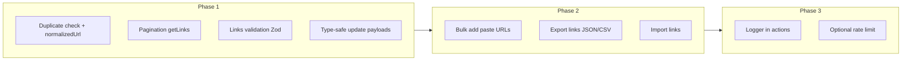

# Link Module Improvements Plan

## Scope

Improvements are grouped into three phases. Phase 1 is foundational (performance, validation, types); Phase 2 adds UX and data portability; Phase 3 improves observability and optional hardening.

---

## Phase 1: Foundation

### 1.1 Optimize duplicate URL check

**Problem:** [src/server/actions/links.ts](src/server/actions/links.ts) `checkDuplicateUrl` loads all links for the user (empty `url` filter) and compares in memory; it does not scale.

**Approach:**

- Add optional `normalizedUrl` to the Link model in [prisma/schema.prisma](prisma/schema.prisma): `normalizedUrl String?` with `@@index([userId, normalizedUrl])`. Run a migration; backfill via a one-off script or in `createLink`/`updateLink` only for new/updated rows (existing rows can stay null and still be checked in memory until backfilled if desired).
- In [src/lib/utils/links.ts](src/lib/utils/links.ts), keep `normalizeUrl()` as the single source of truth.
- In `checkDuplicateUrl`: query by `userId` and `normalizedUrl` (or fallback to current in-memory behavior when `normalizedUrl` is null). Use the same normalized value when creating/updating links so new data is queryable.
- Ensure [src/server/actions/links.ts](src/server/actions/links.ts) `createLink` and `updateLink` set `normalizedUrl` to `normalizeUrl(formattedUrl)` on the stored link.

**Files:** [prisma/schema.prisma](prisma/schema.prisma), [src/server/actions/links.ts](src/server/actions/links.ts), [src/lib/utils/links.ts](src/lib/utils/links.ts).

### 1.2 Pagination for getLinks

**Problem:** `getLinks` returns all matching links; large lists are slow and heavy.

**Approach:** Follow the pattern in [src/server/actions/time-tracking.ts](src/server/actions/time-tracking.ts) (e.g. `getTimeEntries` with `page`, `limit`, `total`, `totalPages`).

- Extend `LinkFilters` in [src/server/actions/links.ts](src/server/actions/links.ts) with optional `page` and `limit` (e.g. default `limit: 50`).
- In `getLinks`: compute `skip = (page - 1) * limit`, run `findMany` with `take: limit`, `skip`, and a separate `count` with the same `where`. Return `{ links, total, page, limit, totalPages }` instead of a bare array.
- Update all call sites: main links page [src/app/(dashboard)/dashboard/links/page.tsx](src/app/\\(dashboard)/dashboard/links/page.tsx) and any other consumers (e.g. archive) to pass `page`/`limit` from searchParams and render pagination UI (prev/next or page numbers). Use URL search params for page so the list is shareable and back-button friendly.

**Files:** [src/server/actions/links.ts](src/server/actions/links.ts), [src/app/(dashboard)/dashboard/links/page.tsx](src/app/\\(dashboard)/dashboard/links/page.tsx), [src/app/(dashboard)/dashboard/links/archive/page.tsx](src/app/\\(dashboard)/dashboard/links/archive/page.tsx) (if it uses `getLinks`), and link list components that receive the result.

### 1.3 Link validation schema

**Approach:** Mirror [src/lib/validations/todos.ts](src/lib/validations/todos.ts) and [src/lib/validations/time-tracking.ts](src/lib/validations/time-tracking.ts).

- Add [src/lib/validations/links.ts](src/lib/validations/links.ts) with Zod:
  - **createLinkSchema:** `url` (non-empty, max length, URL format via custom refine or existing `validateUrl`), optional `title`/`description`/`notes` (max lengths), optional `tags` (array of strings, max length per tag and max array size), optional `linkType` enum, `isFavorite` boolean, `rating` 1–5 or null, optional `collectionIds` (array of cuid).
  - **updateLinkSchema:** same fields as partial, plus optional `collectionIds`.
- Export types with `z.infer<>` (e.g. `CreateLinkInput`, `UpdateLinkInput`).
- In [src/server/actions/links.ts](src/server/actions/links.ts), validate `createLink` and `updateLink` input with these schemas (e.g. `createLinkSchema.safeParse(input)`), map Zod errors to `fieldErrors` and return early on failure; keep existing module/permission and URL-format checks where they add semantics (e.g. duplicate check after validation).

**Files:** [src/lib/validations/links.ts](src/lib/validations/links.ts) (new), [src/server/actions/links.ts](src/server/actions/links.ts).

### 1.4 Type-safe update payloads

**Problem:** In `updateLink` and related code, `updateData` is built with `any`, which weakens type safety.

**Approach:** Define an update type (e.g. `Prisma.LinkUpdateInput` or a minimal type that matches the fields you set) and use it for the object passed to `prisma.link.update`. Replace `any` with that type in [src/server/actions/links.ts](src/server/actions/links.ts) for `updateLink` and any other places that build link update payloads.

**Files:** [src/server/actions/links.ts](src/server/actions/links.ts).

---

## Phase 2: UX and data portability

### 2.1 Bulk add links (paste URLs)

**Approach:** Add a “Bulk add” or “Paste URLs” entry point that accepts multiple URLs (e.g. one per line).

- **UI:** In [src/components/features/links/AddLinkDialog](src/components/features/links/AddLinkDialog/) (or a sibling “Bulk add” dialog/mode): add a textarea for pasted URLs, parse by newlines, trim, filter empty and invalid URLs (reuse `formatLinkUrl` + `validateUrl` from [src/lib/utils/links.ts](src/lib/utils/links.ts)). Optionally show duplicate/similar warnings using existing `checkDuplicateUrl` (per URL or batched if optimized). On submit, loop over valid URLs and call existing `createLink` (or a small helper that reuses the same logic) with optional `extractMetadata` and `collectionIds`; show progress and per-URL errors (e.g. “Link 3: duplicate”, “Link 5: invalid URL”).
- **Server:** Either keep using existing `createLink` in a loop (simplest) or add a `bulkCreateLinks(urls: string[], options?: { collectionIds?, extractMetadata? })` action that runs the same validation and create logic in a loop and returns `{ created: number, failed: Array<{ url, error }> }`. No new DB schema.

**Files:** [src/components/features/links/AddLinkDialog/AddLinkDialog.tsx](src/components/features/links/AddLinkDialog/AddLinkDialog.tsx) (or new BulkAddLinksDialog), [src/server/actions/links.ts](src/server/actions/links.ts) (optional `bulkCreateLinks`), [src/app/(dashboard)/dashboard/links/page.tsx](src/app/\\(dashboard)/dashboard/links/page.tsx) or [LinksPageClient.tsx](src/app/\\(dashboard)/dashboard/links/LinksPageClient.tsx) to expose the bulk entry point.

### 2.2 Export links

**Approach:** Add an export action and UI.

- **Server:** New action in [src/server/actions/links.ts](src/server/actions/links.ts) (e.g. `exportLinks(options?: { format: 'json' | 'csv', collectionId?: string })`). Use existing `getLinks` (with pagination bypass or high limit for export) and permission checks. Return:
  - **JSON:** array of link objects (id, title, url, description, linkType, tags, notes, isFavorite, rating, createdAt, collection names/ids if needed).
  - **CSV:** same fields as columns; escape commas and newlines; trigger download via `Content-Disposition` or return blob and let client download.
- **UI:** “Export” button on links page or in a menu; choose format (and optionally collection filter); call action and trigger file download (e.g. client-side fetch + blob URL or server route that streams the file).

**Files:** [src/server/actions/links.ts](src/server/actions/links.ts), links page or a small export component.

### 2.3 Import links

**Approach:** Support importing the same structure as export (JSON preferred for round-trip; CSV as optional).

- **Server:** New action `importLinks(fileOrJson: string | File, options?: { collectionId?, skipDuplicates? })`. Parse JSON/CSV, validate each row (URL required; use link validation schema for other fields). For each row: check duplicate by URL (reuse normalized check) if `skipDuplicates`; then call same create logic as `createLink` (or a shared internal helper). Return `{ imported: number, skipped: number, errors: Array<{ row, error }> }`.
- **UI:** “Import” button; file picker (accept `.json`, optionally `.csv`); optional “Add to collection” and “Skip duplicates”; submit and show result summary.

**Files:** [src/server/actions/links.ts](src/server/actions/links.ts), [src/lib/validations/links.ts](src/lib/validations/links.ts) (reuse for row validation), import UI component and links page wiring.

---

## Phase 3: Observability and optional hardening

### 3.1 Use app logger in link/collection actions

**Approach:** Replace `console.error` in [src/server/actions/links.ts](src/server/actions/links.ts) and [src/server/actions/collections.ts](src/server/actions/collections.ts) with the logger from [src/lib/utils/logger.ts](src/lib/utils/logger.ts). Use appropriate level (e.g. `logger.error`, `logger.warn`) and include context (e.g. `linkId`, `userId`, `action`) where useful. Do not change return values or behavior; only switch to structured logging.

**Files:** [src/server/actions/links.ts](src/server/actions/links.ts), [src/server/actions/collections.ts](src/server/actions/collections.ts).

### 3.2 Optional: rate limiting and metadata fetch hardening

- **Rate limiting:** If desired, add per-user rate limits for “create link” and/or “extract metadata” (e.g. in-memory or Redis) to avoid abuse; document in plan and implement after Phase 3.1 if approved.
- **Metadata fetch:** Optional hardening for [src/lib/utils/link-metadata.ts](src/lib/utils/link-metadata.ts): enforce max redirect count, allow only `http`/`https`, and optionally block requests to private/internal IP ranges when fetching user-supplied URLs.

These can be separate follow-up tasks after the main plan is done.

---

## Implementation order and dependencies

| Order | Task | Deps |

|-------|------|------|

| 1 | Schema + migration for `normalizedUrl`; update create/update and `checkDuplicateUrl` | None |

| 2 | Link validation Zod + use in create/update | None |

| 3 | Type-safe update payloads in links actions | Validation types |

| 4 | Pagination for `getLinks` + UI (page, limit, totalPages) | None |

| 5 | Bulk add (paste URLs) UI + optional bulk action | None |

| 6 | Export links (JSON/CSV) action + download UI | None |

| 7 | Import links (parse + validate + create) + UI | Export shape, validation |

| 8 | Logger in links and collections actions | None |

Phases 1–3 can be implemented in this order; Phase 3.2 is optional and can be scheduled later.