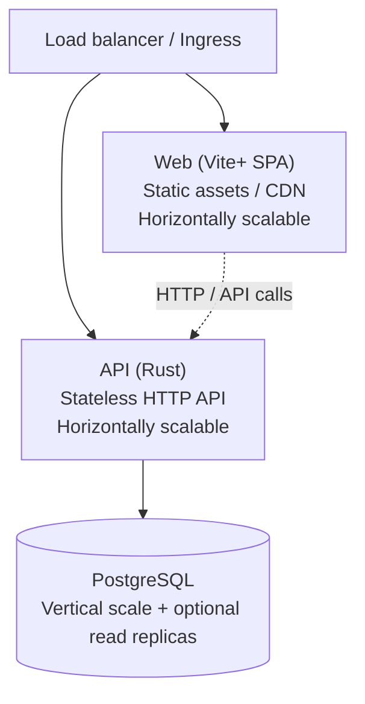

# Migration plan — Web (Vite+), API (Rust), Database

Split the current Next.js full-stack app into three distinct, scalable parts: **Web** (Vite+), **API** (Rust), and **Database** (PostgreSQL). The Web UI stays the same; the backend and build tooling change to meet horizontal and vertical scalability goals.

**Source:** [docs/MIGRATION-PLAN-WEB-API-DATABASE.md](../docs/MIGRATION-PLAN-WEB-API-DATABASE.md)

---

## 1. Current state summary


| Layer        | Current                                                         | Purpose                                      |
| ------------ | --------------------------------------------------------------- | -------------------------------------------- |
| **Web**      | Next.js 16 (App Router), React 18, TypeScript, Tailwind, Prisma | Single app: UI + API routes + server actions |
| **API**      | Next.js API routes (`/api/`*) + server actions                  | Serves Web and iOS; talks to DB via Prisma   |
| **Database** | PostgreSQL 16, Prisma ORM                                       | Single `DATABASE_URL`; migrations via Prisma |
| **iOS**      | Swift app                                                       | Calls same Next.js origin                    |


**Entry points today:** `next dev` / `next start` (one Node process); Docker Compose: `cloudwrkz` app + `postgres`.

---

## 2. Target architecture

- **Web**: Front-end only. Static build from Vite+ (CDN/multiple static hosts). Horizontally scalable.
- **API**: Single responsibility — HTTP API for Web and iOS. Stateless Rust service; scale by adding instances.
- **Database**: Shared PostgreSQL. Scale vertically; optional read replicas for read-heavy workloads.




---

## 3. Part 1 — Web (Vite+)

### Goals

- Rewrite web app using Vite+ so the **UI stays the same** (same pages, components, UX).
- Remove all server-side logic: no API routes, no server actions, no Prisma. Client-only SPA talking to the Rust API.
- Keep React, TypeScript, Tailwind, and existing UI libraries; replace Next.js-specific APIs with Vite+ and explicit API client calls.

### Setup

- **Toolchain:** Vite+ (`vp install`, `vp dev`, `vp build`, etc.).
- **Framework:** Vite + React (React Router for routing).
- **Environment:** Single **API base URL** (e.g. `VITE_API_URL`) used by the API client; no server-side env in the web app.

### Migration steps (Web)

1. Create new app under monorepo (e.g. `apps/web-vite`).
2. Initialize with Vite+ and React + TypeScript + Tailwind.
3. Port layout and pages to React Router; keep existing components, hooks, and styles.
4. **API client:** Central client (e.g. `src/api/client.ts`) using `VITE_API_URL` pointing at the **versioned** API (e.g. `…/api/v1` so all requests go to v1). Session/token (cookie or `Authorization` header); mirror current API surface.
5. **Auth:** Token-based flow — login/register call API; store token; 401 → redirect to login.
6. Replace every server action with a call to the Rust API (same endpoints as iOS).
7. Static assets from Vite build (`public/`, imports); no Next.js `public/` or `next/image`.
8. Remove Next.js, Prisma, and server-only code from the web app.

---

## 4. Part 2 — API (Rust)

### Goals

- Implement all current API surface in **Rust** for Web (Vite+) and iOS.
- Stateless service: auth via tokens (session table). Horizontal scaling (any instance can serve any request).
- Support **SaaS**, **self-host** (Docker Compose), and **enterprise on‑prem** (Kubernetes/Helm). No vendor lock-in; standard primitives (Postgres, optional Redis/broker later).

### Recommended stack

- **HTTP:** Axum (async, middleware, JSON).
- **Database:** SQLx (compile-time SQL, pooling, async). Migrations as SQL in `apps/api/migrations/` (from current Prisma schema).
- **Auth:** Session tokens in `sessions` table; validate on each request; cookie (web) and `Authorization: Bearer` (iOS). **argon2** for passwords (preferred over bcrypt for security).
- **Serialization:** serde (JSON). Optional: OpenAPI for docs and client generation.

### Configuration (env vars)


| Variable          | Required | Purpose                                                           |
| ----------------- | -------- | ----------------------------------------------------------------- |
| `DATABASE_URL`    | Yes      | Postgres connection string (primary).                             |
| `API_HOST`        | No       | Bind host (default `0.0.0.0`).                                    |
| `API_PORT`        | No       | Port (default `8080`).                                            |
| `RUST_LOG`        | No       | Log level (e.g. `info`, `api=debug`).                             |
| `CORS_ORIGINS`    | Yes*     | Comma-separated origins for Web (e.g. `https://app.example.com`). |
| `COOKIE_DOMAIN`   | No       | Domain for session cookie (e.g. `.example.com`).                  |
| `COOKIE_SECURE`   | No       | `true` in production (HTTPS-only cookie).                         |
| `SESSION_MAX_AGE` | No       | Session TTL in seconds (default 7 days).                          |
| `MAX_BODY_SIZE`   | No       | Max request body in bytes (uploads).                              |


 CORS required when Web is on a different origin than API.

### API versioning

- **Versioned:** All app routes under `**/api/v1/`** (e.g. `/api/v1/me`, `/api/v1/auth/login`, `/api/v1/tickets`, …). Enables future v2 without breaking clients.
- **Unversioned:** `GET /api/health`, `GET /api/ping` (and optionally `GET /ready` for readiness). Used by load balancers and orchestration; no `/v1` in path.
- **Router in code:** Mount v1 at `/api/v1`; reserve `/api/v2` for later. Health/ping at `/api/health`, `/api/ping`.

### API contract policy

- **Prefer minimal client changes** when feasible; preserve request/response shapes and status codes where they are already adequate.
- **Breaking changes are allowed** when they clearly improve:
  - **Security:** auth, session handling, token storage, CSRF mitigation, rate limiting.
  - **Performance:** payload shape, pagination, caching semantics, DB efficiency.
  - **Operability:** observability, idempotency, error contracts, tracing.
- **Discipline for any breaking change:**
  - Document the change and rationale.
  - Provide a migration path for Web and iOS (feature flags, version shims, or v2).
  - Use deprecation windows where appropriate.
- **Standardize over time:** error envelope (see below), pagination (cursor or offset + limit), auth strategy (Bearer + optional cookie).

### Error envelope and conventions

- **JSON errors:** Use a consistent envelope for v1, e.g. `{ "error": { "code": "UNAUTHORIZED", "message": "..." } }` with HTTP status matching.
- **Status codes:** 400 validation, 401 unauthenticated, 403 forbidden, 404 not found, 409 conflict, 422 unprocessable, 429 rate limit, 500 internal.
- **Validation:** Return 400/422 with field-level errors when request body fails validation.
- **Pagination:** Define a single convention for list endpoints (e.g. `?limit=20&offset=0` or `?cursor=...&limit=20`); document in API spec.

### Auth strategy

- **Sessions table:** `id`, `user_id`, `token` (opaque, stored hashed or as-is per policy), `expires_at`, `created_at`, optional `user_agent`/`ip`.
- **Validation:** On each v1 request, resolve Bearer token or session cookie to `user_id`; attach to request state; 401 if missing or expired.
- **Cookie (Web):** Set `HttpOnly`, `Secure` in prod, `SameSite=Lax` or `Strict`; domain from `COOKIE_DOMAIN`. Web client can send cookie or `Authorization` header.
- **iOS:** `Authorization: Bearer <token>` only.

### API surface to port (v1)

From current `apps/web/src/app/api`, exposed under `**/api/v1/`**:


| Area             | Endpoints (conceptual, under `/api/v1/`)                                                             |
| ---------------- | ---------------------------------------------------------------------------------------------------- |
| Auth             | POST auth/login, auth/register, session extend, change-password, QR login (request, approve, status) |
| Me               | GET me, auth/me                                                                                      |
| Tickets          | CRUD, list, upload-image, by id                                                                      |
| Todos            | CRUD, list, by id, upload-image                                                                      |
| Links            | CRUD, list, by id, metadata, upload-favicon, shared/collections                                      |
| Collections      | CRUD, list, members                                                                                  |
| Time tracking    | add, by id, pause/resume/stop/complete, breaks, active, events                                       |
| Location history | list, add (if any)                                                                                   |
| Search           | search, auth/search, enhanced                                                                        |
| Profile          | avatar upload, preferences, profile/avatar/[filename]                                                |
| Contact          | contact form POST                                                                                    |
| Admin            | audit events, purge-deleted-accounts, db-query, db-row (if required)                                 |
| Favicons         | serve by filename                                                                                    |


**Unversioned:** `GET /api/health`, `GET /api/ping`; optionally `GET /api/ready` (returns 200 only when DB pool is reachable).

### Project layout (Rust API)

- `**apps/api`** (Rust crate/workspace):
  - `**Cargo.toml`**: Axum, SQLx, tokio, serde, argon2, tower (middleware), tracing.
  - `**src/main.rs`**: Load config from env, create `PgPool` (SQLx), CORS layer, router. Mount v1 at `/api/v1`; mount `/api/health`, `/api/ping` (and `/api/ready`). Graceful shutdown on SIGTERM.
  - `**src/config.rs**`: Parse and validate env vars; expose `ApiConfig`, `DatabaseConfig`, `CorsConfig`, `AuthConfig`.
  - `**src/routes/**`: `mod.rs` (v1 router assembly), `auth.rs`, `me.rs`, `tickets.rs`, `todos.rs`, `links.rs`, `collections.rs`, `time_tracking.rs`, `search.rs`, `profile.rs`, `contact.rs`, `admin.rs`, `favicons.rs`, `health.rs` (health/ping/ready only).
  - `**src/db/**`: `pool.rs` (PgPool creation), `repositories/` or inline queries per domain (sessions, users, tickets, todos, links, etc.).
  - `**src/models/**`: Structs for DB rows and API request/response DTOs; serde for JSON.
  - `**src/auth/**`: `session.rs` (validate token, load user), `password.rs` (argon2 hash/verify), extractors (e.g. `AuthUser`).
  - `**src/error.rs**`: App error enum, `IntoResponse`, consistent error envelope.
  - `**migrations/**`: SQL files (SQLx `migrate!()` or Diesel); initial schema from Prisma export plus `sessions` if not present.

### Database implications (API)

- **Pool:** One `PgPool` per process via SQLx `PgPoolOptions::new()`. Set `max_connections` (e.g. 10–20 per instance) so that **total connections = N_instances × max_connections** stays below Postgres `max_connections`.
- **Sessions:** Table `sessions` (or equivalent) for token storage and validation; index on `token` and `expires_at`.
- **Read replicas (optional later):** Use a second `DATABASE_URL_READ` for read-only queries (e.g. search, list endpoints); single primary for writes.
- **Shard-readiness (optional later):** Ensure `tenant_id` (or equivalent) on key tables and routing boundaries so that a future replication/sharding layer can route by tenant.

### Phased implementation (API)


| Phase                     | Scope                                                                                 | Acceptance criteria                                                                                                             |
| ------------------------- | ------------------------------------------------------------------------------------- | ------------------------------------------------------------------------------------------------------------------------------- |
| **4a. Bootstrap**         | New `apps/api` crate; Axum + SQLx; config from env; CORS; health, ping, ready.        | `GET /api/health` and `GET /api/ping` return 200; `GET /api/ready` returns 200 when DB is up, 503 when down. Docker build runs. |
| **4b. Auth**              | Sessions table, register/login, token validation, Bearer + cookie; argon2.            | Web and iOS can login/register; protected routes return 401 without valid token.                                                |
| **4c. Core domains**      | Port me, tickets, todos, links, collections, time_tracking under `/api/v1`.           | Same contract as current Next.js API for these domains; Web client can point at Rust API and use app.                           |
| **4d. Remaining domains** | Search, profile, contact, admin, favicons, QR login, location history.                | All current API surface available under v1; no remaining dependency on Next.js API for app features.                            |
| **4e. Harden**            | Error envelope, rate limiting (optional), observability (logs, request IDs, metrics). | Consistent error JSON; structured logs with trace ID; optional Prometheus `/metrics` or equivalent.                             |


### Operational plan (API)

- **Docker:** Dockerfile in `apps/api` (multi-stage: build then runtime); image runs single binary; env vars for config.
- **Docker Compose:** Service `api` with `build: apps/api`, env from `.env` or `environment:`; depends on `postgres`; healthcheck via `GET /api/health` or `/api/ready`.
- **Kubernetes/Helm:** Deployment with readiness probe to `/api/ready`, liveness to `/api/health`; config via ConfigMap/Secret; scale replicas via HPA.
- **Observability:** Structured logging (tracing crate); attach request ID (e.g. `X-Request-ID` or generated) to each request and log it; optional metrics endpoint for latency and error rate.
- **Shutdown:** Graceful shutdown: stop accepting new requests, drain in-flight, close DB pool.

### Risks and mitigations (API)


| Risk                      | Mitigation                                                                                                                                    |
| ------------------------- | --------------------------------------------------------------------------------------------------------------------------------------------- |
| Contract drift vs Next.js | Document every endpoint and payload; run contract tests or manual checklist against Web/iOS.                                                  |
| DB connection exhaustion  | Cap `max_connections` per instance; monitor total; tune pool and instance count.                                                              |
| Auth token leakage        | HttpOnly cookie for web where possible; short session TTL; rotate on sensitive actions.                                                       |
| Rollout regression        | Feature flag or parallel run (Web points to Rust API only after 4c); keep Next.js API until 4d done; rollback = point client back to Next.js. |
| Migration ordering        | Run SQL migrations before app start (e.g. in Docker entrypoint or init container); version migrations and fail fast on mismatch.              |


### Definition of done (Rust API)

- `apps/api` exists; builds and runs with Axum + SQLx.
- Health, ping, ready endpoints unversioned; v1 mounted at `/api/v1`.
- All current API routes ported to v1 with same or documented improved contract.
- Auth: sessions table, token validation, argon2, Bearer + cookie.
- Config via env; CORS; connection pooling; graceful shutdown.
- Docker image and Compose service; healthcheck.
- Error envelope and status codes documented; optional observability (request ID, structured logs).
- Web and iOS can use Rust API as sole backend for app features.

---

## 5. Part 3 — Database

### Goals

- Keep PostgreSQL as single source of truth. Schema from Prisma; drive with **SQL migrations** alongside Rust API (or separate migration runner).
- No direct DB access from Web; only Rust API (and optional admin/CLI) connects.

### Migration strategy

- **Option A:** Keep Prisma for schema and migration authoring; run `prisma migrate deploy` from Node job or Rust startup. Rust uses SQLx/Diesel. Duplicate source (Prisma + Rust types) but minimal workflow change.
- **Option B (recommended long-term):** Export current schema to SQL; maintain all new migrations as SQL in `apps/api/migrations/`. SQLx or Diesel migration runner. Single source of truth in SQL + Rust types.

### Connection pooling

- Per-process pool in Rust (e.g. SQLx `PgPoolOptions` with `max_connections`). Total connections = N_instances × max_connections; keep within PostgreSQL `max_connections`.
- Optional: read replica URL for read-only queries (search, list tickets).

---

## 6. Monorepo and repo structure

```
Cloudwrkz/
├── apps/
│   ├── web/              # (optional) legacy Next.js during migration; remove when done
│   ├── web-vite/         # Vite+ React SPA
│   ├── api/              # Rust API (Axum + SQLx)
│   └── ios/              # Existing iOS app (point to new API base URL)
├── packages/             # (optional) shared TS types for Web ↔ API
│   └── api-types/
├── docs/
├── pnpm-workspace.yaml   # apps/web-vite; optionally packages/api-types
└── docker-compose.yml   # api + postgres (+ optional nginx for web static)
```

- pnpm workspace: include `apps/web-vite` (and `packages/api-types` if added). iOS outside pnpm.
- Rust: `apps/api` is a Cargo project; not in pnpm.

---

## 7. Phased migration plan


| Phase                           | Scope                                                                                                                                | Outcome                                                         |
| ------------------------------- | ------------------------------------------------------------------------------------------------------------------------------------ | --------------------------------------------------------------- |
| **1. API first**                | Implement Rust API with same routes and shapes as Next.js API. Use existing PostgreSQL and Prisma (or exported SQL). Health/ping.    | iOS and test client can use Rust API; Next.js still serves web. |
| **2. Web on Vite+**             | New Vite+ app; port UI and routing; API client points to Rust API. Dual-run Next.js and Vite+; switch traffic when ready.            | Web UI from Vite+ build; no Next.js API usage from web.         |
| **3. Decommission Next.js API** | Remove API routes and server actions from Next.js; remove Prisma from web. Optionally remove Next.js and rename `web-vite` to `web`. | Single backend: Rust API only.                                  |
| **4. DB ownership**             | Move migration ownership to Rust (SQL in `apps/api`). Optionally drop Prisma.                                                        | One migration path; DB only touched by API.                     |
| **5. Scale and harden**         | Load balancer, API replicas, CDN for web, DB tuning and optional read replicas.                                                      | Horizontal and vertical scalability in place.                   |


---

## 8. Completion status (from codebase)

Checked against the repo on **2025-03-17**.

### Web (Vite+) — Vite+ migration progress


| Item                                                  | Status          | Notes                                                                                                                                                                                                                                                                                                                                                                                           |
| ----------------------------------------------------- | --------------- | ----------------------------------------------------------------------------------------------------------------------------------------------------------------------------------------------------------------------------------------------------------------------------------------------------------------------------------------------------------------------------------------------- |
| New Vite+ React app in monorepo                       | **Done**        | `apps/web-vite` exists; in `pnpm-workspace.yaml`.                                                                                                                                                                                                                                                                                                                                               |
| Same UI (layout, pages, components) with React Router | **Done**        | React Router in `App.tsx`; public, dashboard, and admin routes; `DashboardLayout`, `DashboardSidebar`, pages for Home, Login, Register, About, Contact, Terms, Privacy, Health, Banned, Dashboard, Tickets, Todos, Links, Time tracking, Profile, Settings, Search, Notifications, Statistics, Archive, and admin (Users, Groups, Modules, Settings, Sessions, Tickets, Statistics, Audit, Db). |
| API client with configurable base URL and auth token  | **Done**        | `apps/web-vite/src/api/client.ts`: `VITE_API_URL` (fallback `/api`), Bearer token from localStorage, 401 handling and `auth:unauthorized` event, get/post/put/patch/delete/upload.                                                                                                                                                                                                              |
| Auth: token-based (cookie or header) against API      | **Done**        | `AuthProvider` with login/register/logout/refreshUser; token in localStorage; requests use `Authorization: Bearer`.                                                                                                                                                                                                                                                                             |
| Static build deployable to CDN                        | **Done**        | Vite build → `dist/`; dev proxy `/api` → `http://localhost:3000` for current Next.js API.                                                                                                                                                                                                                                                                                                       |
| All server actions replaced by API calls to Rust API  | **In progress** | Web-vite uses API client; currently proxying to **Next.js** API (no Rust API yet). Full replacement when Rust API exists.                                                                                                                                                                                                                                                                       |


### API (Rust)


| Item                                                                          | Status          | Notes                         |
| ----------------------------------------------------------------------------- | --------------- | ----------------------------- |
| Bootstrap (Axum + SQLx, health/ping/ready, CORS, config)                      | **Not started** | No `apps/api` (Rust) in repo. |
| Auth (sessions table, token validation, argon2, Bearer + cookie)              | **Not started** | —                             |
| Core domains (me, tickets, todos, links, collections, time_tracking) under v1 | **Not started** | —                             |
| Remaining domains (search, profile, contact, admin, favicons, QR, location)   | **Not started** | —                             |
| Error envelope, observability, Docker/Compose, graceful shutdown              | **Not started** | —                             |


### Database


| Item                                       | Status                 | Notes                                                |
| ------------------------------------------ | ---------------------- | ---------------------------------------------------- |
| PostgreSQL; only API (and tooling) connect | **Current**            | Web has no direct DB; Rust API will own connections. |
| Migrations: Prisma or SQL in Rust repo     | **Not started**        | Still Prisma in `apps/web`.                          |
| Pool size and instance count tuned         | **N/A** until Rust API | —                                                    |


### Repo and ops


| Item                                           | Status          | Notes                                                                     |
| ---------------------------------------------- | --------------- | ------------------------------------------------------------------------- |
| Monorepo layout: web-vite, api, ios            | **Partial**     | `apps/web`, `apps/web-vite`, `apps/ios` exist. `apps/api` (Rust) missing. |
| Docker/Compose for local API + DB              | **Partial**     | Compose exists for web + postgres; no Rust API service yet.               |
| Production: LB + API replicas + CDN + Postgres | **Not started** | —                                                                         |


---

## 9. Checklist summary (plan todos)

- **Web (Vite+)**
  - New Vite+ React app in monorepo
  - Same UI (layout, pages, components) with React Router
  - API client with configurable base URL and auth token
  - All server actions replaced by API calls to Rust API (in progress: using Next.js API via proxy)
  - Auth: token-based (cookie or header) against API
  - Static build deployable to CDN; horizontally scalable
- **API (Rust)** (see §4 for phased implementation 4a–4e)
  - Bootstrap: Axum + SQLx; health, ping, ready; CORS; config from env
  - API versioning: v1 at `/api/v1/`; unversioned `/api/health`, `/api/ping`, `/api/ready`
  - Auth: sessions table; token validation; argon2; Bearer + cookie; error envelope
  - All current API routes ported under v1; same or documented improved contract
  - Connection pooling; graceful shutdown; Docker/Compose; healthcheck
  - Observability: request ID, structured logs; optional metrics
  - Deployable as container; horizontally scalable (N instances)
- **Database**
  - PostgreSQL remains; only API (and optional tooling) connect
  - Migrations: Prisma or SQL in Rust repo; single source of truth
  - Pool size and instance count tuned for `max_connections`
  - Optional read replicas for read scaling
- **Repo and ops**
  - Monorepo layout: `apps/web-vite`, `apps/api`, `apps/ios`
  - Docker/Compose for local API + DB (and optional static web)
  - Production: LB + API replicas + CDN + managed or self-hosted Postgres

