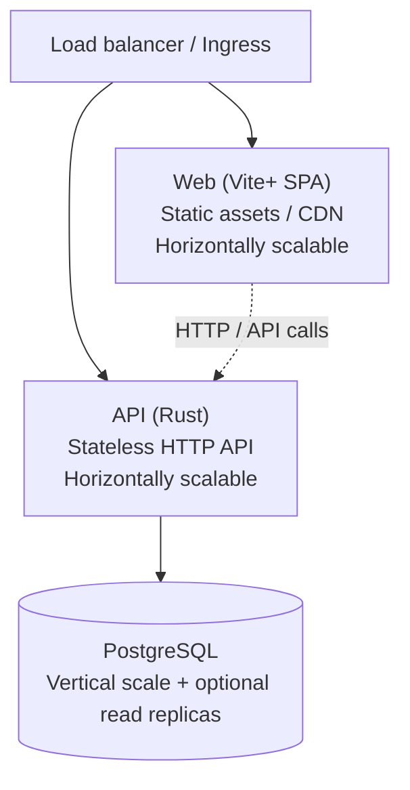

# Migration plan — Web (Vite+), API (Rust), Database

Split the current Next.js full-stack app into three distinct, scalable parts: **Web** (Vite+), **API** (Rust), and **Database** (PostgreSQL). The Web UI stays the same; the backend and build tooling change to meet horizontal and vertical scalability goals.

**Source:** [docs/MIGRATION-PLAN-WEB-API-DATABASE.md](../docs/MIGRATION-PLAN-WEB-API-DATABASE.md)

---

## 1. Current state summary


| Layer        | Current                                                         | Purpose                                      |
| ------------ | --------------------------------------------------------------- | -------------------------------------------- |
| **Web**      | Next.js 16 (App Router), React 18, TypeScript, Tailwind, Prisma | Single app: UI + API routes + server actions |
| **API**      | Next.js API routes (`/api/`*) + server actions                  | Serves Web and iOS; talks to DB via Prisma   |
| **Database** | PostgreSQL 16, Prisma ORM                                       | Single `DATABASE_URL`; migrations via Prisma |
| **iOS**      | Swift app                                                       | Calls same Next.js origin                    |


**Entry points today:** `next dev` / `next start` (one Node process); Docker Compose: `cloudwrkz` app + `postgres`.

---

## 2. Target architecture

- **Web**: Front-end only. Static build from Vite+ (CDN/multiple static hosts). Horizontally scalable.
- **API**: Single responsibility — HTTP API for Web and iOS. Stateless Rust service; scale by adding instances.
- **Database**: Shared PostgreSQL. Scale vertically; optional read replicas for read-heavy workloads.




---

## 3. Part 1 — Web (Vite+)

### Goals

- Rewrite web app using Vite+ so the **UI stays the same** (same pages, components, UX).
- Remove all server-side logic: no API routes, no server actions, no Prisma. Client-only SPA talking to the Rust API.
- Keep React, TypeScript, Tailwind, and existing UI libraries; replace Next.js-specific APIs with Vite+ and explicit API client calls.

### Setup

- **Toolchain:** Vite+ (`vp install`, `vp dev`, `vp build`, etc.).
- **Framework:** Vite + React (React Router for routing).
- **Environment:** Single **API base URL** (e.g. `VITE_API_URL`) used by the API client; no server-side env in the web app.

### Migration steps (Web)

1. Create new app under monorepo (e.g. `apps/web-vite`).
2. Initialize with Vite+ and React + TypeScript + Tailwind.
3. Port layout and pages to React Router; keep existing components, hooks, and styles.
4. **API client:** Central client (e.g. `src/api/client.ts`) using `VITE_API_URL` pointing at the **versioned** API (e.g. `…/api/v1` so all requests go to v1). Session/token (cookie or `Authorization` header); mirror current API surface.
5. **Auth:** Token-based flow — login/register call API; store token; 401 → redirect to login.
6. Replace every server action with a call to the Rust API (same endpoints as iOS).
7. Static assets from Vite build (`public/`, imports); no Next.js `public/` or `next/image`.
8. Remove Next.js, Prisma, and server-only code from the web app.

---

## 4. Part 2 — API (Rust)

### Goals

- Implement all current API surface in **Rust** for Web (Vite+) and iOS.
- Stateless service: auth via tokens (session table or JWT). Horizontal scaling (any instance can serve any request).

### Recommended stack

- **HTTP:** Axum.
- **Database:** SQLx (or Diesel). Recommendation: SQLx; migrations as SQL (from current Prisma schema).
- **Auth:** Session tokens in `sessions` table; validate on each request; cookie (web) and `Authorization: Bearer` (iOS). bcrypt or argon2 for passwords.
- **Config:** `DATABASE_URL`, `API_PORT`, `API_HOST`, `RUST_LOG`, CORS origins, cookie domain.

### API versioning

- The new Rust API is **versioned**. The initial implementation is **v1**.
- All versioned routes live under `**/api/v1/`** (e.g. `/api/v1/me`, `/api/v1/auth/login`, `/api/v1/tickets`, …). This allows future versions (v2, etc.) to coexist behind the same host and load balancer.
- **Web** and **iOS** clients use a base URL that includes the version (e.g. `VITE_API_URL=https://api.example.com/api/v1` or base `https://api.example.com` with path prefix `/api/v1` in the client). No unversioned app routes.
- **Health / ops** endpoints remain **unversioned** so load balancers and tooling can call them without a version: e.g. `GET /api/health`, `GET /api/ping` (or `GET /health`, `GET /ping` at root). These are not part of the versioned surface.
- Router layout in code: mount the v1 route group at `/api/v1`; add further version mounts (e.g. `/api/v2`) when needed.

### API surface to port (v1)

From current `apps/web/src/app/api`, exposed under `**/api/v1/`**:


| Area             | Endpoints (conceptual, under `/api/v1/`)                                                             |
| ---------------- | ---------------------------------------------------------------------------------------------------- |
| Auth             | POST auth/login, auth/register, session extend, change-password, QR login (request, approve, status) |
| Me               | GET me, auth/me                                                                                      |
| Tickets          | CRUD, list, upload-image, by id                                                                      |
| Todos            | CRUD, list, by id, upload-image                                                                      |
| Links            | CRUD, list, by id, metadata, upload-favicon, shared/collections                                      |
| Collections      | CRUD, list, members                                                                                  |
| Time tracking    | add, by id, pause/resume/stop/complete, breaks, active, events                                       |
| Location history | list, add (if any)                                                                                   |
| Search           | search, auth/search, enhanced                                                                        |
| Profile          | avatar upload, preferences, profile/avatar/[filename]                                                |
| Contact          | contact form POST                                                                                    |
| Admin            | audit events, purge-deleted-accounts, db-query, db-row (if required)                                 |
| Favicons         | serve by filename                                                                                    |


**Unversioned (no `/v1`):** `GET /api/health`, `GET /api/ping` (or equivalent at root).

Preserve **request/response shapes** and **status codes** for minimal client changes; clients target the versioned base URL (e.g. `/api/v1`) and auth header/cookie.

### Project layout (Rust API)

- `**apps/api`** (or `apps/api-rust`): Rust workspace.
  - `Cargo.toml`, `src/main.rs` (bootstrap: DB pool, router, CORS, shutdown). Mount **v1** at `/api/v1`; reserve `/api/v2`, etc. for future versions. Unversioned: `/api/health`, `/api/ping`.
  - `src/routes/`: auth, tickets, todos, links, time_tracking, search, admin, health (all under v1 namespace).
  - `src/db/`: connection pool, queries/repository.
  - `src/models/`: structs matching DB; serde for JSON.
  - `src/auth/`: token validation, password hashing.
  - `migrations/`: SQL migrations (SQLx or Diesel).

---

## 5. Part 3 — Database

### Goals

- Keep PostgreSQL as single source of truth. Schema from Prisma; drive with **SQL migrations** alongside Rust API (or separate migration runner).
- No direct DB access from Web; only Rust API (and optional admin/CLI) connects.

### Migration strategy

- **Option A:** Keep Prisma for schema and migration authoring; run `prisma migrate deploy` from Node job or Rust startup. Rust uses SQLx/Diesel. Duplicate source (Prisma + Rust types) but minimal workflow change.
- **Option B (recommended long-term):** Export current schema to SQL; maintain all new migrations as SQL in `apps/api/migrations/`. SQLx or Diesel migration runner. Single source of truth in SQL + Rust types.

### Connection pooling

- Per-process pool in Rust (e.g. SQLx `PgPoolOptions` with `max_connections`). Total connections = N_instances × max_connections; keep within PostgreSQL `max_connections`.
- Optional: read replica URL for read-only queries (search, list tickets).

---

## 6. Monorepo and repo structure

```
Cloudwrkz/
├── apps/
│   ├── web/              # (optional) legacy Next.js during migration; remove when done
│   ├── web-vite/         # Vite+ React SPA
│   ├── api/              # Rust API (Axum + SQLx)
│   └── ios/              # Existing iOS app (point to new API base URL)
├── packages/             # (optional) shared TS types for Web ↔ API
│   └── api-types/
├── docs/
├── pnpm-workspace.yaml   # apps/web-vite; optionally packages/api-types
└── docker-compose.yml   # api + postgres (+ optional nginx for web static)
```

- pnpm workspace: include `apps/web-vite` (and `packages/api-types` if added). iOS outside pnpm.
- Rust: `apps/api` is a Cargo project; not in pnpm.

---

## 7. Phased migration plan


| Phase                           | Scope                                                                                                                                | Outcome                                                         |
| ------------------------------- | ------------------------------------------------------------------------------------------------------------------------------------ | --------------------------------------------------------------- |
| **1. API first**                | Implement Rust API with same routes and shapes as Next.js API. Use existing PostgreSQL and Prisma (or exported SQL). Health/ping.    | iOS and test client can use Rust API; Next.js still serves web. |
| **2. Web on Vite+**             | New Vite+ app; port UI and routing; API client points to Rust API. Dual-run Next.js and Vite+; switch traffic when ready.            | Web UI from Vite+ build; no Next.js API usage from web.         |
| **3. Decommission Next.js API** | Remove API routes and server actions from Next.js; remove Prisma from web. Optionally remove Next.js and rename `web-vite` to `web`. | Single backend: Rust API only.                                  |
| **4. DB ownership**             | Move migration ownership to Rust (SQL in `apps/api`). Optionally drop Prisma.                                                        | One migration path; DB only touched by API.                     |
| **5. Scale and harden**         | Load balancer, API replicas, CDN for web, DB tuning and optional read replicas.                                                      | Horizontal and vertical scalability in place.                   |


---

## 8. Completion status (from codebase)

Checked against the repo on **2025-03-17**.

### Web (Vite+) — Vite+ migration progress


| Item                                                  | Status          | Notes                                                                                                                                                                                                                                                                                                                                                                                           |
| ----------------------------------------------------- | --------------- | ----------------------------------------------------------------------------------------------------------------------------------------------------------------------------------------------------------------------------------------------------------------------------------------------------------------------------------------------------------------------------------------------- |
| New Vite+ React app in monorepo                       | **Done**        | `apps/web-vite` exists; in `pnpm-workspace.yaml`.                                                                                                                                                                                                                                                                                                                                               |
| Same UI (layout, pages, components) with React Router | **Done**        | React Router in `App.tsx`; public, dashboard, and admin routes; `DashboardLayout`, `DashboardSidebar`, pages for Home, Login, Register, About, Contact, Terms, Privacy, Health, Banned, Dashboard, Tickets, Todos, Links, Time tracking, Profile, Settings, Search, Notifications, Statistics, Archive, and admin (Users, Groups, Modules, Settings, Sessions, Tickets, Statistics, Audit, Db). |
| API client with configurable base URL and auth token  | **Done**        | `apps/web-vite/src/api/client.ts`: `VITE_API_URL` (fallback `/api`), Bearer token from localStorage, 401 handling and `auth:unauthorized` event, get/post/put/patch/delete/upload.                                                                                                                                                                                                              |
| Auth: token-based (cookie or header) against API      | **Done**        | `AuthProvider` with login/register/logout/refreshUser; token in localStorage; requests use `Authorization: Bearer`.                                                                                                                                                                                                                                                                             |
| Static build deployable to CDN                        | **Done**        | Vite build → `dist/`; dev proxy `/api` → `http://localhost:3000` for current Next.js API.                                                                                                                                                                                                                                                                                                       |
| All server actions replaced by API calls to Rust API  | **In progress** | Web-vite uses API client; currently proxying to **Next.js** API (no Rust API yet). Full replacement when Rust API exists.                                                                                                                                                                                                                                                                       |


### API (Rust)


| Item                                                  | Status          | Notes                         |
| ----------------------------------------------------- | --------------- | ----------------------------- |
| Axum + SQLx/Diesel, health/ping, CORS, pooling        | **Not started** | No `apps/api` (Rust) in repo. |
| All current API routes ported; same contract          | **Not started** | —                             |
| Auth: session table + token validation; bcrypt/argon2 | **Not started** | —                             |
| Stateless; container deploy; N instances              | **Not started** | —                             |


### Database


| Item                                       | Status                 | Notes                                                |
| ------------------------------------------ | ---------------------- | ---------------------------------------------------- |
| PostgreSQL; only API (and tooling) connect | **Current**            | Web has no direct DB; Rust API will own connections. |
| Migrations: Prisma or SQL in Rust repo     | **Not started**        | Still Prisma in `apps/web`.                          |
| Pool size and instance count tuned         | **N/A** until Rust API | —                                                    |


### Repo and ops


| Item                                           | Status          | Notes                                                                     |
| ---------------------------------------------- | --------------- | ------------------------------------------------------------------------- |
| Monorepo layout: web-vite, api, ios            | **Partial**     | `apps/web`, `apps/web-vite`, `apps/ios` exist. `apps/api` (Rust) missing. |
| Docker/Compose for local API + DB              | **Partial**     | Compose exists for web + postgres; no Rust API service yet.               |
| Production: LB + API replicas + CDN + Postgres | **Not started** | —                                                                         |


---

## 9. Checklist summary (plan todos)

- **Web (Vite+)**
  - New Vite+ React app in monorepo
  - Same UI (layout, pages, components) with React Router
  - API client with configurable base URL and auth token
  - All server actions replaced by API calls to Rust API (in progress: using Next.js API via proxy)
  - Auth: token-based (cookie or header) against API
  - Static build deployable to CDN; horizontally scalable
- **API (Rust)**
  - Axum (or chosen framework) + SQLx/Diesel
  - API versioning: v1 at `/api/v1/`; unversioned `/api/health`, `/api/ping`
  - All current API routes ported under v1; same contract for Web and iOS
  - Auth: session table + token validation; bcrypt/argon2
  - Stateless; connection pooling; CORS and cookie config
  - Health/ping endpoints
  - Deployable as container; horizontally scalable (N instances)
- **Database**
  - PostgreSQL remains; only API (and optional tooling) connect
  - Migrations: Prisma or SQL in Rust repo; single source of truth
  - Pool size and instance count tuned for `max_connections`
  - Optional read replicas for read scaling
- **Repo and ops**
  - Monorepo layout: `apps/web-vite`, `apps/api`, `apps/ios`
  - Docker/Compose for local API + DB (and optional static web)
  - Production: LB + API replicas + CDN + managed or self-hosted Postgres

